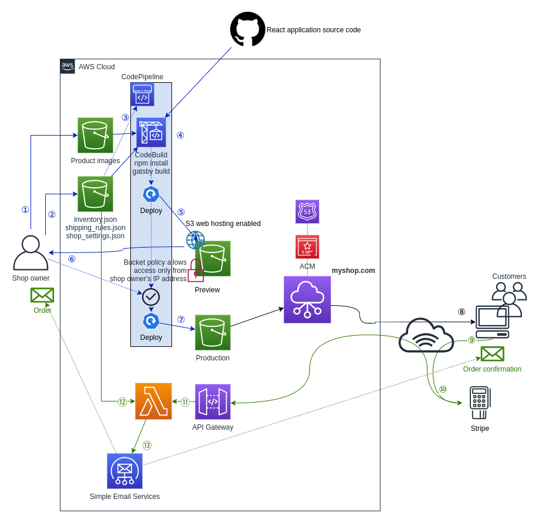

# Disclaimer

The software available in this repository is provided "as is" without warranty of any kind, either express or implied. Use at your own risk.

Deploying this solution incurs costs of using AWS resources.

# What this is

This application is a configurable and customizable [SSG](https://en.wikipedia.org/wiki/Web_template_system#Static_site_generators) e-shop you deploy at your AWS account.

The solution leverages [Gatsby](https://www.gatsbyjs.com/) and several AWS services.

It is a fully functioning e-commerce solution out of the box.
For payments processing, it integrates with [Stripe](https://stripe.com/).

It is an extremely cost effective solution thanks to making use of
["static site generation"](https://en.wikipedia.org/wiki/Web_template_system#Static_site_generators)
and "serverless" approaches.
Running a shop with moderate traffic should cost less then $1 a month.

# Demo

https://aws-ssg-ecommerce-demo.aniskov.com

# Architecture



1. Shop owner uploads product images to S3 bucket.
1. Shop owner uploads inventory data as JSON file to S3 bucket.
1. The new version of the inventory file triggers CodePipeline.
1. The build stage downloads shop’s source code, product images and inventory data. Finally it runs gatsby build command to generate the shop.
1. First, it deploys the result to preview web site hosted in S3 bucket accessible only by the shop owner.
1. The owner reviews the result and approve deployment to "production".
1. The pipeline deploys it.
1. Shop visitors browse the catalog, add items to the browser-side shopping cart.
1. Checkout process involves Stripe payment workflow.
1. Being initiated by Stripe, the callback request is...
1. … routed to AWS Lambda function...
1. … which checks the data provided, completes the payment...
1. ... and sends email notifications to the customer and the shop owner.

# Deployment

## Deploy CloudFormation stack

Click one of following links, to launch the CloudFormation template in AWS Console.
As of September 2020, because the solution uses Amazon SES and SES Templates, you can deploy it only in the listed regions.
* [eu-west-1](https://eu-west-1.console.aws.amazon.com/cloudformation/home?region=eu-west-1#/stacks/create/template?stackName=my-shop&templateURL=https%3A%2F%2Fs3-eu-west-1.amazonaws.com/aniskov.cloudformation.components.eu-west-1%2Fssg-ecommerce.v1.0.0.template)
* [us-east-1](https://us-east-1.console.aws.amazon.com/cloudformation/home?region=us-east-1#/stacks/create/template?stackName=my-shop&templateURL=https%3A%2F%2Fs3.amazonaws.com/aniskov.cloudformation.components.us-east-1%2Fssg-ecommerce.v1.0.0.template)
* [us-west-2](https://us-west-2.console.aws.amazon.com/cloudformation/home?region=us-west-2#/stacks/create/template?stackName=my-shop&templateURL=https%3A%2F%2Fs3-us-west-2.amazonaws.com/aniskov.cloudformation.components.us-west-2%2Fssg-ecommerce.v1.0.0.template)

During specifying stack detail, provide following parameters:
* Shop name
* Shop owner email address - your valid email address
* Shop legal address
* Access to the preview website - Your IP address in [CIDR format](https://en.wikipedia.org/wiki/Classless_Inter-Domain_Routing). If not sure, [ask Google to tell you your address](https://www.google.com/search?q=my+ip).

If your are deploying the solution for the first time, I recommend to live the rest of the parameters at their defaults. You will be able to change them later.

Typically, it takes 8-15 minutes to complete deployment, if the parameters are default.

Make a note of the output values:
* aProductImagesBucket
* bShopDatabaseBucket
* dPreviewUrl
* eShopUrl
* fStripeWebhookEndpoint

## Populate the shop inventory

Download [demo inventory and shop settings archive](https://github.com/MaksimAniskov/aws-ssg-ecommerce-demoshop/archive/1.0.0.zip) (13MB). Unzip it.

Upload all PNG files in *productimages* folder to S3 bucket *aProductImagesBucket*.

Upload *inventory.zip*, *shipping_rules.zip* and *shop_settings.zip* in *database* folder to S3 bucket *bShopDatabaseBucket*.

Jump to CodePipeline console. Watch shop build process there.

## Review your shop created

Open the preview URL (dPreviewUrl) in the browser. Here is your shop preview.

In CodePipeline console hit Approve/Review to release the make the stuff publicly available at "real" shop URL (eShopUrl). After CopyToWebsite stage complete, check out the URL.

## Enable checkout by configuring Stripe

**I recommend to begin by configuring it with test Stripe keys**. If you are going to configure live keys, make sure that you have [uploaded your real inventory and configured real shipping rules and shop settings](#How-to-update-the-inventory).

Obtain from Stripe your API's public (publishable) and secret keys.

Create a Stripe webhook endpoint providing *fStripeWebhookEndpoint* as the endpoint URL and selecting following events to send:
* payment_intent.succeeded
* payment_intent.processing
* payment_intent.payment_failed

Make a note of the endpoint's signing secret.

Jump to CloudFormation console. Start updating the stack. Provide *Stripe/Secret key*
 and *Stripe/Webhook signing secret* parameters.

Download your shop_settings.zip; unzip it, and open shop_settings.json for editing.

Change "stripe_example" part of to simply "stripe". Set "publicKey" value there.

Update shop_settings.zip with the new shop_settings.json; copy shop_settings.zip to S3 *bShopDatabaseBucket* bucket. Wait CodePipeline to rebuild the shop and update the preview. Approve for promoting it to the public site, or try the checkout on preview first.

Try to complete checkout providing one of [Stripe's test card numbers](https://stripe.com/docs/testing#cards).

## Configure domain name

Update the stack providing *Domain name* parameter. Make note of following new values in stack's output: gNameServers and hHostedZoneId.

Configure the domain name registrar to use the name servers listed in *gNameServers*.

Make sure that domain name resolves alright. Use nslookup utility: ```nslookup -type=soa your_domain_name```. Or any online nslookup tool. For example, 
[network-tools.com/nslookup](https://network-tools.com/nslookup/).

Deploy yet another stack [by launching this template in AWS Console](https://us-east-1.console.aws.amazon.com/cloudformation/home?#/stacks/create/template?region=us-east-1&stackName=my-shop-cert&templateURL=https%3A%2F%2Fs3.amazonaws.com/aniskov.cloudformation.components.us-east-1%2Fcert.v1.0.0.template).
<br/>**It is important** to deploy the stack in **us-east-1** region (North Virginia).
<br/>The stack will create a "global" AWS ACM certificate. You later will configure CloudFront with this certificate. Provide value of *hHostedZoneId* as *Amazon Route 53 Hosted Zone id* parameter.

After the stack has been created, find and make a note of CertificateArn output value.

Jump back to application's main stack. Update it providing value for *CloudFront certificate ARN* parameter.

Stack's output value *eShopUrl* should change to the domain name you provided. Open the URL in the browser.

## Configure email notifications

You use nSendOrderConfirmationEmail parameter to configure to whom the application sends order notifications.

There are three options available: ```disabled``` (default), ```to the shop```, and ```to the shop and to the buyer```.

Before to switch to the later two you must configure SES in your account for sending emails.

For ```to the shop``` mode that's enough to do the following.

* [verify shop's domain name (lDomainName) on SES](https://docs.aws.amazon.com/ses/latest/DeveloperGuide/verify-domain-procedure.html) opting in for [generating DKIM settings](https://docs.aws.amazon.com/ses/latest/DeveloperGuide/send-email-authentication-dkim-easy-setup-domain.html). (Otherwise, emails are going to appear as spoofed or SPAM in the inbox.)

* [verify shop's email address on SES](https://docs.aws.amazon.com/ses/latest/DeveloperGuide/verify-email-addresses-procedure.html).

For using ```to the shop and to the buyer``` mode, you also need to [reach out AWS to remove your account from the Amazon SES sandbox](https://docs.aws.amazon.com/ses/latest/DeveloperGuide/request-production-access.html).

# How to update the inventory

The application takes the inventory from the bucket on S3 (refer *bShopDatabaseBucket* stack's output value), from the archive (default name is *inventory.zip*).

Use [demo shop inventory file](https://github.com/MaksimAniskov/aws-ssg-ecommerce-demoshop/blob/master/database/inventory.json) as reference. The format of the file is pretty much obvious.

Items with ```"storefront": true``` appear on store's home page.
Items with ```"featured": true``` appear at the top of the home page.

## Shipping pricing rules

Global and per-shipping-category rules live in *shipping_rules.zip*, while per-product ones are attaches to item's data residing in *inventory.zip*.

[Here is demo shop's *shipping_rules.zip* content](https://github.com/MaksimAniskov/aws-ssg-ecommerce-demoshop/blob/master/database/shipping_rules.json).

Let's explain how you express the rules by examples.

The following defines, that shipping to Slovenia costs 5.5 (in shop's configured currency), to any other country in Europe: 10, to the rest of the world: 125.
Refer [this file](https://github.com/MaksimAniskov/aws-ssg-ecommerce/blob/master/lambda/lib/shipping/countries.json) for the details on country and continent data it uses.
```json
"cost": {
    "byCountry": {
        "SI": 5.5
    },
    "byContinent": {
        "EU": 10
    },
    "default": 125
}
```

This example defines a per-shipping category rule.
```json
"cost": {
    "byCategory": {
        "bulky": {
            "byCountry": {
                "SI": 35
            },
            "byContinent": {
                "EU": 40
            },
            "default": 250
        }
    },
}
```

To apply a category rule to an inventory item, you specify in *shipping_rules.json* ```shipping``` object.
```json
{
    ...,
    "shipping": {
        "category": "bulky"
    }
}
```

The ```shipping``` object an item has can specify rules that apply only for this item.
```json
{
    ...,
    "shipping": {
        "cost": {
            "byCountry": {
                "SI": 1
            },
            "byContinent": {
                "EU": 2
            },
            "default": 3
        }
    }
}
```

Also, likely, you'll want to restrict some countries or entire regions from purchasing from your shop. Let's take a look at [the demo shop's restrictions](https://github.com/MaksimAniskov/aws-ssg-ecommerce-demoshop/blob/master/database/shipping_rules.json).
```json
"restrictions": {
    "byCategory": {
        "superbulky": {
            "byCountry": {
                "SI": null
            },
            "default": "We do not ship super bulky items outside of Slovenia"
        }
    },
    "byCountry": {
        "KP": "We do not ship to North Korea"
    },
    "byContinent": {
        "AN": "We do not ship to Antarctica"
    }
}
```

# Customization

## Logo image and site icon


Put following files to *cStaticAssetsBucket* on S3.
* images/icon.png
* images/logo.png

Initiate site rebuild by clicking *Release change* on CodePipeline console.

## Deeper customization

Hire a [React](https://reactjs.org/) developer to customize [the demo shop application](https://github.com/MaksimAniskov/aws-ssg-ecommerce-jam).

# Deleting application

1. Use Amazon Route 53 console to find the hosted zone. Delete all CNAME, MX and TXT records from it.

1. Use Amazon S3 console to find following buckets. Clear them all (delete objects), but do not delete the buckets themself.
<br/>*appname*-productimages-*ramdomsuffix*
<br/>*appname*-shopdatabase-*ramdomsuffix*
<br/>*appname*-donottouchthis-*ramdomsuffix*
<br/>*appname*-previewwebsite-*ramdomsuffix*
<br/>*appname*-website-*ramdomsuffix*

1. Delete [the certificate stack](#Configure-domain-name) if you crated it.

1. Delete the CloudFormation stack.
